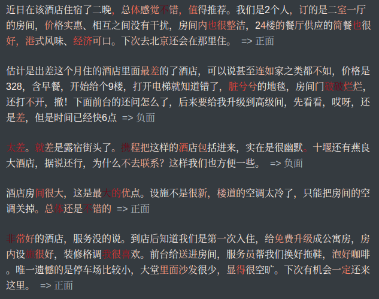

# text-grad-cam-visualization


深度学习是一个"黑盒"系统，为理解其内部的工作原理，可视化充当重要的角色。可视化往往是深度学习模型的“事后解释”的重要工具。Class Activation Mapping（CAM，可以翻译为**类别激活映射图**）是CV中可视化技术之一，利用特征的可视化来探究神经网络的类别判断依据、预测输出的贡献分配及其理解内部组件的工作机制。


这里实现基于梯度的CAM，称为Grad-CAM，具体可参看文献[Grad-CAM: Visual Explanations from Deep Networks via Gradient-based Localization](https://arxiv.org/pdf/1610.02391.pdf)。理论上Grad-CAM可以提取任意一层特征层，一般我们选择Pooling层上游最近的特征层。下面的实现和演示是把这种技术引入到NLP中。

博客文章[Grad-CAM在NLP可视化中的应用
](https://allenwind.github.io/blog/13482/)

文本上的热力图，权重即重要性自上而下从左到右逐渐变大，


准备好相应的数据以及修改数据位置参数后，运行

```bash
$ python3 model_visualization.py
```

然后可视化结果写到`results.md`，可以通过命令行`typora results.md`观察结果。Typora可以到 https://typora.io/ 下载安装。


Grad-CAM可视化示例一：


Grad-CAM可视化示例二：




## 参考

[1] [Grad-CAM: Visual Explanations from Deep Networks via Gradient-based Localization](https://arxiv.org/pdf/1610.02391.pdf)

[2] [Grad-CAM++: Improved Visual Explanations for Deep Convolutional Networks](https://arxiv.org/pdf/1710.11063.pdf)

[3] [image-integrated-gradients](https://github.com/allenwind/image-integrated-gradients)

